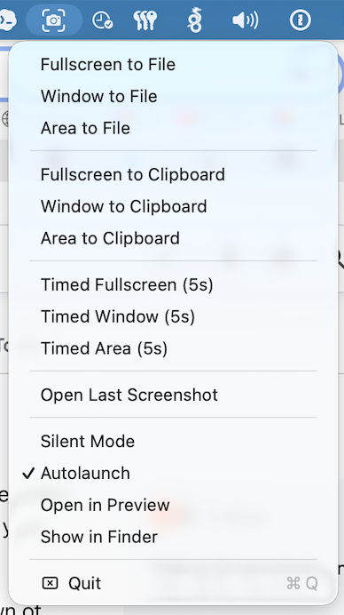

# ScreenshotMenu

A screenshot menu for the macOS menu bar. Nine capture modes, one click each, no
keyboard shortcuts to memorise.

It is a thin native wrapper around `screencapture`, the screenshot tool that
already ships with macOS. About 240 lines of Swift, no dependencies, no
telemetry, no network code, no Accessibility permission. Signed with a Developer
ID and notarised by Apple.



## Install

Download the latest `.dmg` from
[Releases](https://github.com/ScreenshotMenu/ScreenshotMenu/releases/latest),
drag the app to Applications, and launch it. A camera icon appears in the menu
bar.

The app is notarised, so Gatekeeper lets it open without the
right-click-to-open dance.

Or build it yourself — see [Building](#building).

## What it does

**Capture to a file** — fullscreen, a window, or a dragged selection. A save
dialog opens once the screen is clear, so the dialog never ends up in the shot.

**Capture to the clipboard** — the same three modes, straight to the pasteboard,
ready to paste.

**Timed capture** — fullscreen, window or area to a file after five seconds, for
menus and hover states that vanish when you reach for a shortcut.

**Open Last Screenshot** — reopens the last file you saved.

### Settings

| | |
|---|---|
| **Silent Mode** | Capture without the shutter sound. |
| **Autolaunch** | Start at login. |
| **Open in Preview** | Open each capture in Preview, ready to mark up. |
| **Show in Finder** | Reveal each saved file in Finder instead. |

`Open in Preview` and `Show in Finder` are mutually exclusive; turning one on
turns the other off.

## Permissions

ScreenshotMenu asks for **Screen Recording** and nothing else.

macOS requires that permission for any app that captures the screen, including
Apple's own Screenshot app. The prompt says "record your screen and system
audio" because that is the single permission covering both; this app never
records video or audio, and has no code that could.

It does **not** ask for Accessibility. Menu bar screenshot apps often do,
because driving another app's menus is the easy way to get a capture into an
editor. ScreenshotMenu passes `-P` to `screencapture` instead and lets macOS
hand the image to Preview directly, so nothing here can control your computer.

There is no network code in the app at all — no analytics, no update check, no
crash reporting.

## How it works

macOS already has a capable screenshot engine at `/usr/sbin/screencapture`. It
handles selection, window picking, timers, the shutter sound, clipboard output
and handing a capture to Preview. What it does not have is a way to reach any of
that without remembering flags.

So this app is a menu, and every item runs `screencapture` with the right
arguments. That is genuinely the whole design:

```swift
@objc func areaToClipboard() {
    captureToClipboard(arguments: ["-sc"])
}
```

Keeping it that thin is the point. Captures come from Apple's own code path, so
they behave exactly like the system's, and there is little here to go wrong or
to audit — [`AppDelegate.swift`](Sources/ScreenshotMenu/AppDelegate.swift) is one
file you can read in a few minutes.

If you want annotation, OCR, scrolling capture or a screenshot history, use
[Shottr](https://shottr.cc) or CleanShot X. This app deliberately does none of
that.

## Building

Requires macOS 13 or later and a Swift toolchain (Xcode or the Command Line
Tools).

```sh
make bundle        # build ScreenshotMenu.app
make run           # build and launch
make install       # build and copy to /Applications
```

Releases are signed and notarised with `make release`, which needs a Developer
ID certificate and a `notarytool` keychain profile.

## Licence

MIT — see [LICENSE](LICENSE).
